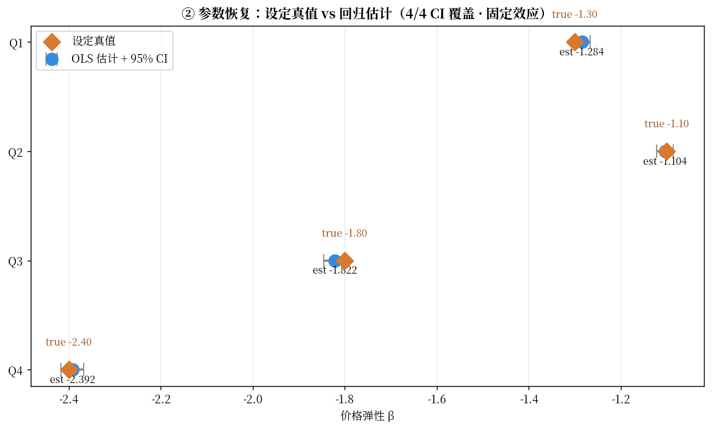
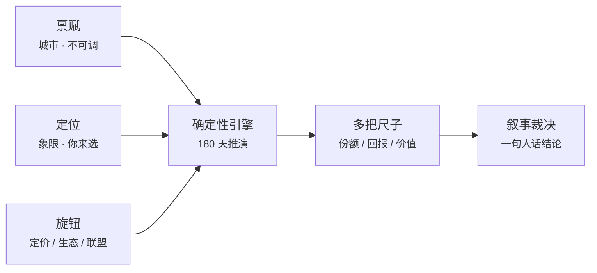

# 中国区域新能源汽车定价沙盘

> **赢销量 ≠ 赢价值。**
>
> 一个可以拨动的定价沙盘：选一座城市、挑一种战略，然后打一场价格战——看着自己冲上销量第一，同时把价值输光。

**🔗 [在线试玩](https://chinese-regional-nev-marketing-sandbox-simulator-3lpxhv6sebdda.streamlit.app/)**（免费部署，12 小时无访问会休眠，首次打开需等约 30 秒唤醒）

<details>
<summary><b>English summary</b> (UI is in Chinese)</summary>

<br>

An interactive pricing sandbox for China's regional NEV (new-energy vehicle) market.
Core thesis: **winning volume ≠ winning value**.

Pick a city (factor endowment) and a strategy quadrant, then run a price war — and watch
yourself take the #1 market-share position while your economic value spread goes deeply
negative. Same round, different yardstick, opposite verdict.

**What makes it more than a toy**: the data is synthetic, but the behavioural parameters —
price elasticity β and cost pass-through γ — are **planted in the data-generating process
and then recovered by regression**. The recovery table (estimate vs. planted truth, with
confidence intervals) ships inside the app. That is something real-world data cannot
give you: **verifiable parameters**. Nine real automakers serve only as qualitative
anchors for the quadrants; they are not used to calibrate any number.

**Structure**: a deterministic 180-day engine with Monte-Carlo bands → DuPont
decomposition → ROIC vs. market-value-weighted WACC → value spread; a Logit share model
with best-response pricing and a slow ecosystem/alliance layer; and a retrieval-augmented
briefing where **financial figures never enter the prompt** — numbers travel as
pre-formatted strings into template slots, text comes from retrieval, and the two only
meet at the render layer.

**Stack**: Python · Streamlit · statsmodels · Plotly · NumPy/pandas · SQLite

**Note**: the interface, the verdict copy, and the generated briefings are all in Chinese.
The five-step walkthrough below is the fastest way in even without reading Chinese —
the charts and rankings carry most of the argument on their own.

</details>

---

## 30 秒看懂

| # | 你做什么 | 屏幕上出现什么 |
|---|---|---|
| 1 | 打开「**象限地图**」，找到 **Q1 · 纯电先锋** | 高端纯电、靠智驾与服务立溢价、**毛利薄**。记住这三个字 |
| 2 | 切到「**沙盘**」，象限选 **Q1**，城市随意 | 首屏说：**初始状态 · 还没有胜负——这是这座城、这个象限的基线**。它在等你出牌 |
| 3 | 只拖「**① 定价**」滑块，拉到最左 **−30%** | 初始态标题当场换成裁决：**独赢群输——你抢下了销量头名，价值却被过度抛弃** |
| 4 | 看**图一** | 你的点冲到**份额第一**，同时掉到**价值最后** |
| 5 | 读图一下方那行读数 | 「**指标翻转：份额领跑却价值垫底**」——份额第 1 名 / 价值第 6 名 |

**为什么会这样**：薄毛利的象限经不起降价。价格能换来销量，但换不来价值——因为降价是**谁都能复制**的手段，复制之后大家一起亏。真正拉开差距的是不可复制的东西：自研、生态、联盟。

**接下来可以试**：换 **Q3 · 垂直整合** 打同样的价格战（成本传导最低，最扛原料波动）· 拉「原材料价格冲击」看不同城市的成本抗性 · 拨「生态投资」和「换电联盟」找不靠降价的赢法 · 点「↺ 回到初始」换个象限重来 · 填入自己的 API Key 生成本局商业分析简报。

---

## 这是什么

一个新能源汽车行业的定价决策沙盘。四个象限由「动力路线 × 价格层级」两根轴切出（纯电先锋 / 全路线高端 / 垂直整合 / 极致性价比），每个象限锚定几家真实车企的画像作为参照；城市则提供不同的要素禀赋，决定你的成本结构有多抗涨价。

你有三个动作：**定价**、**生态投资**、**是否加入换电联盟**；环境给你两个变量：**城市**和**原材料价格冲击**。任意一处改动，下方图表即时重算——引擎一路算到财务报表，告诉你这一局赚没赚钱、又创没创造价值。

最后换一把尺子看同一局：用份额排名你是赢家，用价值排名你是输家。**结论会翻转**——这正是这个沙盘想说的事。

### 数据说明

数据是**合成的**，不是抓取的真实销量或财报。

但合成不等于随便填：行为参数（价格弹性 β、成本传导 γ）是**先埋进数据生成过程、再用回归从数据里恢复出来的**，恢复值与埋入真值的对照表就显示在应用里（展开「参数恢复表」即可查看）。这是真实数据做不到的事——**参数可验证**。九家真实车企只作为象限的定性锚点，用于校准量级与序数，不用于标定数值。



*每个点是一次恢复：横轴埋入的真值，纵轴回归估计值，误差棒是 95% 置信区间。落在对角线上即恢复成功。*

---

## 因果链



完整的系统架构图见 [`NEV_architecture.svg`](NEV_architecture.svg)；RAG 的离线/运行期数据流见 [`phase4_rag_dataflow_offline_and_runtime.svg`](phase4_rag_dataflow_offline_and_runtime.svg)。

这条骨架是**领域中性**的——把「城市 / 象限 / 定价」换成「产区 / 品类 / 渠道」，同一套框架可以搬去快消、旅游、农产品、就业。新能源汽车只是它的第一次微调。

### 三层架构

| 层 | 内容 | 关键点 |
|---|---|---|
| **数值层** | `nev.db`（6 张表） | 由 `generate_data.py` 的 DGP 合成，β/γ 埋在其中 |
| **系数层** | `calibration.py` → `simulation_config.json` | 回归恢复 β/γ，附标准误供蒙特卡洛抽样 |
| **模型层** | `simulate.py` · `financials.py` · `game.py` | 离线标定 + 在线推演 + 博弈引擎 |
| **文案层** | `copy_cn.py` | 独立于计算，改它热重载、不重跑 |

**财务栈**：ROE → 杜邦三因子 → ROIC → WACC → **价值利差 = ROIC − WACC**
**博弈栈**：快层价格 Bertrand / 慢层生态抬升，分场（象限竞技场）× 分尺子（指标可切换）
**AI 简报**：数字走「引擎 → 定值字符串 → 模板占位符」，文字走「检索 → 模型」，**只在渲染层汇合——财务数字从不进提示词**

---

## 本地运行

```bash
git clone https://github.com/nevejd620/Chinese-Regional-NEV-Marketing-Sandbox-simulator.git
cd Chinese-Regional-NEV-Marketing-Sandbox-simulator
pip install -r requirements.txt

python calibration.py     # 参数恢复 → 生成 simulation_config.json
streamlit run app.py      # 启动沙盘
```

Python 3.11。运行期**不依赖任何向量栈**（无 sentence-transformers / faiss / chromadb）——检索向量在构建期离线算好随仓库走。

商业分析简报需要自备 API Key，在界面内填入即可（存在会话内存，不落盘、不进仓库）。不填也能用，界面会退回预生成的缓存简报。

### 仓库结构

```
app.py               两 tab 界面（象限地图 / 沙盘）
├─ calibration.py    回归恢复 β/γ → simulation_config.json
├─ simulate.py       180 天确定性引擎 + 蒙特卡洛置信带
├─ financials.py     杜邦 → ROIC → WACC → 价值利差
├─ game.py           Logit 份额 + 最优反应 + 生态/联盟慢层
├─ brief.py          检索 → 简报 → 出口对账 → Word 导出
├─ triggers.py       动作触发检索的规则层
├─ build_corpus.py   构建期：语料切片 → 嵌入 → 向量（需 API Key）
├─ make_cache.py     构建期：预生成缓存简报（断网也能演示）
├─ copy_cn.py        全部可见文案（改它不重跑）
├─ generate_data.py  数据生成过程（DGP）——β/γ 埋在这里
├─ config.py         真值常数
├─ ensure_db.py      部署自举：nev.db 缺失或不可用时重建
├─ corpus/           检索语料 + 离线算好的向量
└─ cache/            预生成的简报缓存
```

---

## 已知的简化

如实标注，不掩盖（详见应用内「关于 / 诚实声明」）：

- **两套价值利差口径**：「你自己这本账」锚该城基线财报，「同象限相对位置」锚象限单位经济，绝对符号可以相反。两者打架时首屏会当场点破。
- **你是外生的价格领导者**：对手按最优反应还手，但不做对称同时博弈、不做重复博弈。比较静态，非均衡求解。
- **γ 恢复 8/10**：两个区域 CI 未覆盖真值（R² 健康、象限序数正确）。β 4/4 全绿。
- **部分字段有意未接入引擎**：自研分、换电网络、BOM 成本链在库里但不驱动数字。

**请不要用它做任何真实的投资或经营决策。**

---

## 开发过程

`PHASE0` ~ `PHASE5_audit_log.md` 记录了每个阶段的设计决策、验收清单，以及——最要紧的——**决策演变台账：什么被推翻了、为什么**。

比起「做了什么」，那部分记的是「哪些路已经走过、不必再走」。

| 阶段 | 内容 |
|---|---|
| 0 | 数据地基：DGP 合成六张表，β/γ 埋入 |
| 1 | 单城市引擎 + 首次上线：回归恢复 β/γ，180 天推演 |
| 2 | 财务解剖：杜邦 → ROIC → WACC → 价值利差，动态穿零轴 |
| 3 | 全国定价博弈：Logit 份额 + 最优反应 + 生态/联盟慢层 |
| 4 | 合页 + Action-triggered RAG：数字与文字两条通道物理分离 |
| 5 | 收尾与叙事：演示路径、诚实声明、部署自举修复 |

另有 [`0PROJECT_CHARTER_scope.md`](0PROJECT_CHARTER_scope.md) —— 一份**范围护栏**，
用来在每次「为了更真实再改一点」的冲动出现时喊停。它比路线图更常被翻开。
